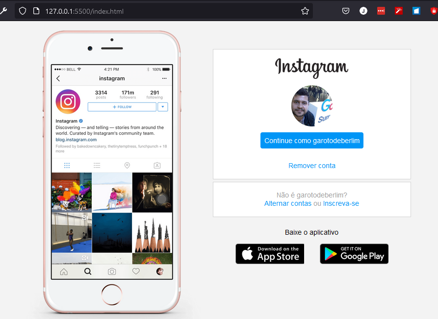
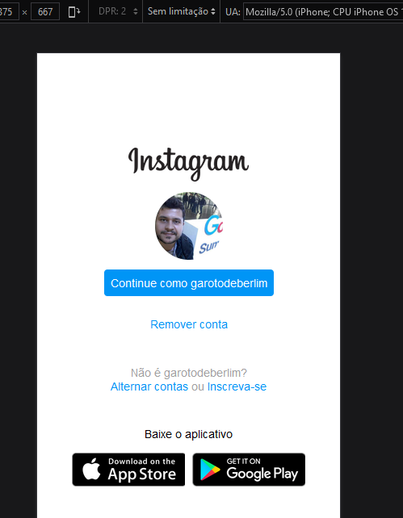

	  

<h1>Instagram clone (HTML + CSS)</h1>

Interface de login do Instagram desenvovido com o CSS Flexbox, entregue como requisito para conclusão do bootcamp **Fullstack Developer** da [DIO](https://dio.me/sign-up?ref=B4LLE4R5RE).

------

## Demo

**Desktop**

  

**Mobile**

  

------
## 🚀 Let's code! 🚀

### Os requisitos para replicar este projeto:

* [HTML básico](https://www.w3schools.com/html/)
* [CSS básico](https://developer.mozilla.org/pt-BR/docs/Web/CSS)

-----------

## Contato

**Author:** Jonas Araujo de Avila Campos

**Confira mais projetos: [AQUI](https://github.com/jonasaacampos)**

  
  

